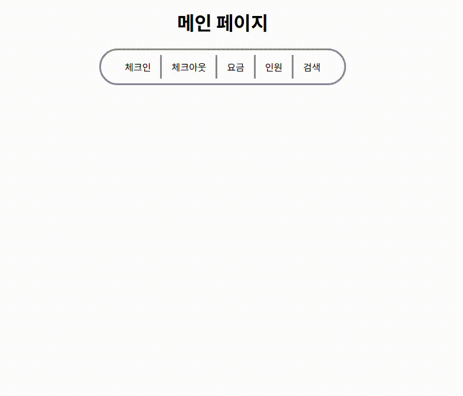
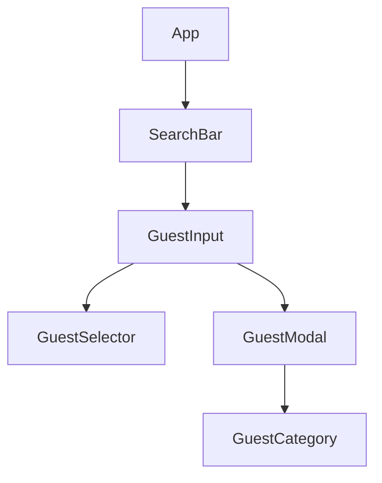
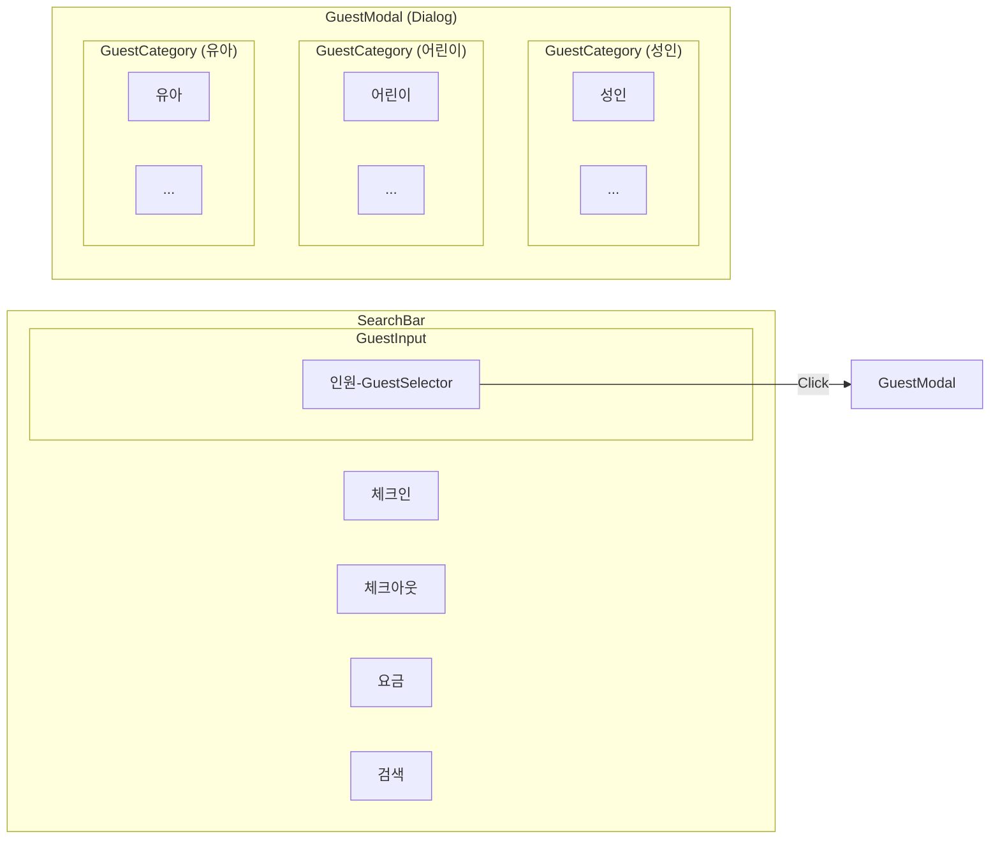
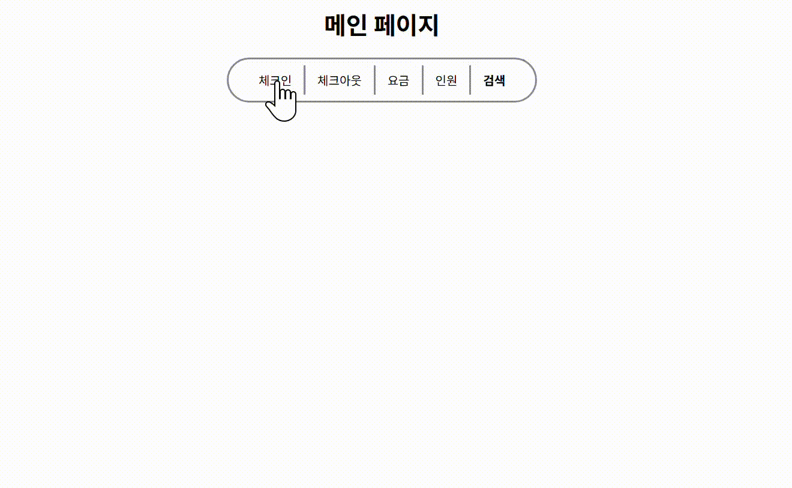
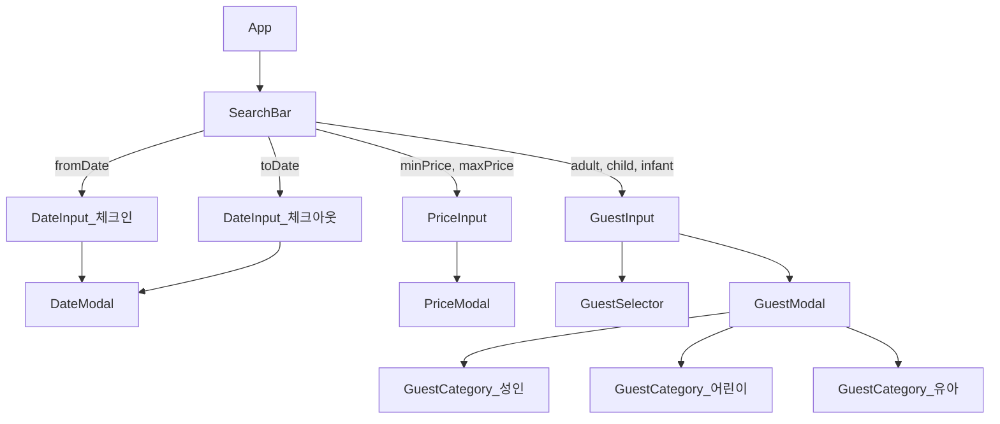
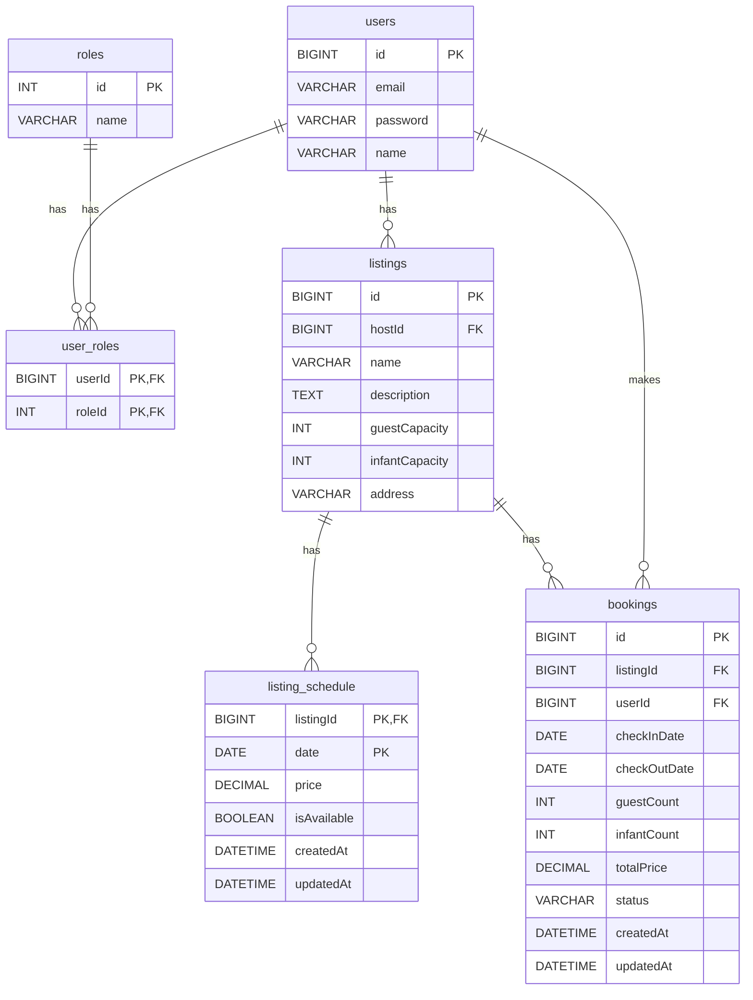

# 🏠web-p4-bangbang
- 부스트캠프 맴버십 4번째 미션.
- Airbnb 만들어보기.

<details>
  <summary>WK 1</summary>

# WK 1
## 이번주 목표.
- React를 밑바닥부터 학습하자.
- ERD 설계, 배포, API 설계는 평소에도 해봤다.
- 그러나 React를 활용한 기초적인 구현은 지금 하지 않으면 다음에 또 해야한다.
- 그래서 이번주는 useState, useEffect, useRef를 실질적으로 활용할 수 있는 `인원 조절 모달창` 구현을 목표로한다.

## ✍️학습 목표
- 조만간 팀 프로젝트를 진행한다고 했다.
- 그때 나는 React 못해서 짐이 되기 싫었다.
- 그래서 내 학습 목표는 `React로 컴포넌트를 구성할 줄 아는 수준`이 되는것이다.
- 그러기 위해서는 거창한 구현을 AI를 통해 여러개 진행하기보단
최대한 스스로 구현해보는 연습을 할것이다.

## 🧗성장 목표
- 이번주가 끝나면 `그래도 React 좀 쓸줄 아네?` 수준까지는 만들고 싶다.
- 그러기 위해서는 보여주기식 구현보다는 학습을 위한 구현이 우선되어야한다고 생각한다.
- 미션 외적으로는 내가 진행한 부분에 대해서 "왜"라는 질문을 답하고 싶다.
- 그냥 react, vite, nginx 써서 구현했습니다. 끝! 이 아니라
어떤 후보지와 고민이 있었고 해당 기술을 적용했다로 이어질려고 노력할것이다.

## 🤖AI 활용 목표
- 언제부턴가 AI를 내가 구현하기 애매한 부분에 대해서만 활용했었다.
- 이번주는 Perplexity Pro 24개월 버전도 얻었겠다. 내가 성장하기위해 조언을 주는 역할로 사용해볼것이다.
- 정보같은건 최대한 공식문서를 활용할것이다. (AI 는 허상이 많아서 공식문서 읽는게 맘편하다.)
- AI는 정보 전달보다는 "왜"라는 질문을 계속 던지게하는 "리뷰어"로서 역할을 맡길것이다.

## Quick Start
- [배포한 Vercel](https://bangbang-henna.vercel.app/)에 접속한다.
- 인원 버튼을 눌러본다.
- 모달창 내부를 눌렀을때 모달창이 닫히지 않음을 확인한다.
- 유아는 성인이 필수인 조건이 만족되는지 확인해본다.
- 성인, 어린이, 유아 +,- 버튼을 눌러보며 합계 로직이 제대로 동작하는지 확인한다.


## 컴포넌트 구조.


## 컴포넌트 시각 구조


</details>


<details>
  <summary>WK 2</summary>

# WK2
## ✍️이번주 학습 목표.
- 밸런스.
- 기본기.
- 이동시간 책 보기.
### 프론트.
- props drilling 문제를 체감할만큼 컴포넌트를 계층적으로 만들기.
- 검색바에 올인.
- [프론트 계획](https://www.notion.so/P4-wk2-20251020-292748edda9b80909881e4dcf9f12529?pvs=24)
### 백엔드.
- OAuath, 검색 기능, 도커 배포.
- [백엔드 계획](https://www.notion.so/P4-wk2-20251020-292748edda9b80c2814ce3799d50a2f5?pvs=24)

## 🧗성장 목표.
- 다른 분들을 보며 배우기. 특히 PR을 랜덤하게 보자.
(늘 안했던건데 습관들이고 싶음.)
- `리액트`, `nest.js`, `TypeORM`, `docker`를 왜 쓰는지 알게 되기.

## 🤖 AI 활용 목표.
- 코어한 부분은 반드시 내가하기. (state 정하기, api 응답값 같은것들.)
- 코드외에 공식문서를 찾는데 사용하기. (perplexity)
- AI와 "왜"라는 질문에 대해 토론하는 습관 들이기.

## 구현한 내용.(서치바)
- 실제 fetch는 못하고 컴포넌트만 구성.


## 컴포넌트 구조.


## [물리적 DB 구조(DDL)](./첨부파일/DDL.md)

## ERD

## 이해을 위한 예제 데이터들.

### users
```
id, email, password, name
1 user1@example.com hashed_password1 User_One
2 user2@example.com hashed_password2 User_Two
```
### roles
```
id, name
1 ROLE_USER
2 ROLE_HOST
```
### user_roles
```
userId, roleId
1 1
1 2
2 1
```
### listings
```
id, hostId, name, description, guestCapacity, infantCapacity, address
1 1 "Cozy Apartment" "A lovely place in the city center" 2 0 "123 Main St"
2 1 "Spacious Villa" "Perfect for families" 6 2 "456 Oak Ave"
```
### listing_schedule
```
listingId, date, price, isAvailable
1 2025-10-24 100000 true
1 2025-10-25 110000 true
2 2025-10-24 250000 true
```
### bookings
```
id, listingId, userId, checkInDate, checkOutDate, guestCount, infantCount, totalPrice, status
1 1 2 2025-10-24 2025-10-26 2 0 210000 PENDING
```

</details>

<details>
  <summary>WK 3</summary>
  
# WK 3
## ✍️ 학습 목표.
- nest 철학 이해하기. request, response 생명주기 이해하기.
- docker를 활용한 개발 및 배포 흐름 이해하기. docker-compose를 어떻게 쓸것인가!
- 테스트 작업으로 프로젝트 관리하기.
## 🧗 성장 목표.
- 단순 학습이 아닌 `완성품`을 목표. (프로 마인드)
- 특정한 작업에 매몰되지 말고 전체를 바라보는 시야 갖기.
- 데드라인날 허둥대지 않게 작업 분배하기.
## 🤖 AI 활용 목표.
- 내가 `공식 문서`를 실습할 수 있는 보조로 사용하기.
- AI 의견을 비판적으로 바라보고 딴지 걸어보기.
- AI의 코드 책임져보기. (결국 내가 승인한거니까! 내가 AI를 부려먹는 책임자야.)
  
</details>
