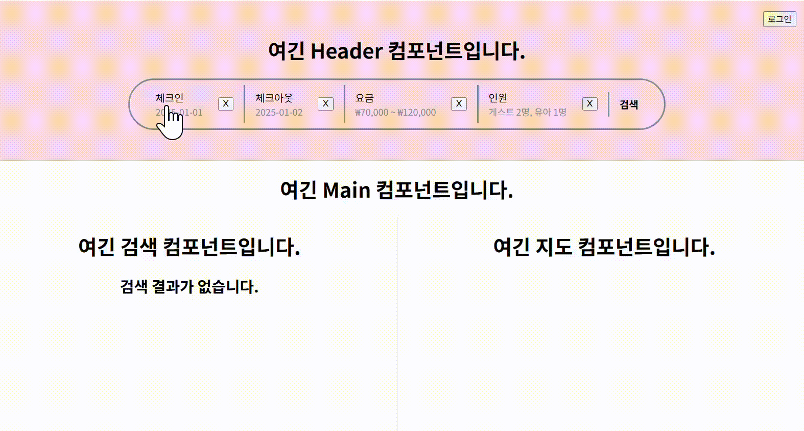
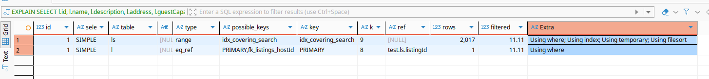
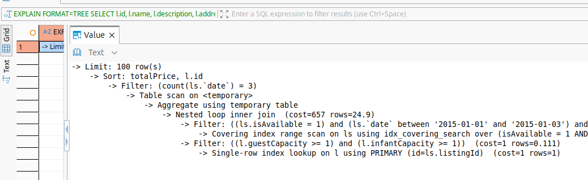

# Airbnb Clone — 대용량 숙소 검색 시스템

> 네이버 부스트캠프 멤버십 과정에서 1인으로 진행한 Airbnb 클론 프로젝트입니다.
> 프론트엔드, 백엔드, 인프라 전 영역을 직접 설계하고 구현했으며, 그 중 백엔드와 인프라에 가장 많은 시간을 투자했습니다.

## 프로젝트 목표

핵심 목표는 MySQL을 활용한 숙소 검색 기능 구현이었습니다.
실제 서비스에 가까운 환경을 만들기 위해 1000개의 숙소에 10년 치 예약 일정을 생성했고, 그 결과 약 300만 건의 데이터가 만들어졌습니다.
이 환경에서 날짜, 가격, 가용성 조건을 조합한 검색 쿼리를 얼마나 효율적으로 만들 수 있는지를 고민했습니다.

## 기술 스택

| 영역 | 기술 |
|---|---|
| Backend | TypeScript, NestJS, TypeORM |
| Database | MySQL 8.0 |
| Frontend | TypeScript, React 19, Vite |
| Infra | Docker, Docker Compose, Testcontainers |
| Test | Jest, Supertest, Testcontainers |

---

## 핵심 고민

> 프로젝트를 진행하며 겪었던 3가지 핵심 고민 사항입니다.

### 1. 대용량 데이터 검색 (9,000ms → 5ms)

300만 건의 `listing_schedule` 테이블에서 날짜, 가격, 가용성 조건을 조합한 검색 쿼리가 초기에 9,000ms 이상 소요되었습니다.

"어떤 인덱스를 써야 하는가"가 핵심 고민이었습니다. 검색에 사용되는 컬럼들을 무작정 추가하는 대신, 8가지 인덱스 후보군(C0~C7)을 직접 구성하고 각각의 Read 속도, Write 속도, 실행 계획을 실험으로 비교했습니다. 그 결과 커버링 인덱스(Covering Index)를 최종 선택했고, 검색 성능뿐 아니라 Insert 성능과 메모리 사용량에 미치는 영향까지 함께 검증하여 Trade-off를 확인했습니다.

- 상세 의사결정 과정: [ADR-003 복합 인덱스 설계](./첨부파일/adr/003-covering-index-strategy.md)
- 검색 쿼리 분리 전략: [ADR-002 검색 쿼리 설계](./첨부파일/adr/002-search-query-separation.md)

### 2. 300만 건 시드 데이터 생성

외부 스크립트(Node.js)나 CSV 파일 없이, 재귀 CTE와 Cross Join만으로 단일 SQL 파일에서 300만 건의 데이터를 약 30초 만에 생성합니다.
Docker 컨테이너가 올라올 때 `init.sql` 하나로 스키마 생성과 데이터 삽입이 모두 완료되므로, 별도의 런타임 환경 없이 누구나 동일한 테스트 환경을 재현할 수 있습니다.

- 상세 의사결정 과정: [ADR-001 시드 데이터 전략](./첨부파일/adr/001-seed-data-strategy.md)

### 3. Docker 기반 환경 분리 및 테스트 격리

Prod와 Dev 환경은 Docker Compose로 관리하고, 테스트 환경은 Testcontainers를 통해 코드 레벨에서 MySQL 컨테이너를 자동으로 생성/삭제하는 구조로 분리했습니다.


테스트 환경에서는 300만 건의 시드 데이터를 삽입하지 않고 DDL(스키마)만 주입하여 테스트 기동 시간을 단축했습니다. 인메모리 DB(SQLite) 대신 실제 MySQL 컨테이너를 사용한 이유는, 커버링 인덱스 등 MySQL 고유의 실행 계획을 검증해야 했기 때문입니다.

- 상세 의사결정 과정: [ADR-004 인프라 전략](./첨부파일/adr/004-devops-docker-strategy.md)

---

## 실행 방법

### 백엔드 서버 기동
```bash
git clone https://github.com/shininghyunho/web-p4-bangbang project
cd project

# 배포용 (최초 기동 시 시드 데이터 생성으로 약 1분 소요)
docker compose up prod_backend --build

# 개발용
docker compose up dev_backend --build
```

### 테스트 실행
```bash
cd backend
npm install
npm run test:e2e
```

### 프론트엔드 기동
```bash
cd frontend
npm install
npm run dev
# localhost:5173 접속
```

---

## 참고 자료

### 숙소 검색 기능
> 검색 페이지에서 체크인/체크아웃 날짜, 최소/최대 가격, 인원수(성인,청소년,유아)를 입력하여 검색해볼 수 있습니다. 10년치 데이터(300만건 이상) 검색이 10ms 이내로 걸립니다.



### 검색 쿼리 인덱스 실행 계획

> 실행 계획 검증에 사용한 검색 쿼리와 EXPLAIN 결과입니다.

#### 검색 쿼리

```sql
SELECT 
    l.id,
    l.name, 
    l.description, 
    l.address, 
    l.guestCapacity, 
    l.infantCapacity,
    SUM(ls.price) AS totalPrice
FROM listings AS l
INNER JOIN listing_schedule AS ls ON l.id = ls.listingId
WHERE ls.date BETWEEN ? AND ?
  AND ls.isAvailable = 1
  AND ls.price BETWEEN ? AND ?
  AND l.guestCapacity >= ?
  AND l.infantCapacity >= ?
GROUP BY l.id
HAVING COUNT(ls.date) = ?
ORDER BY totalPrice ASC, l.id
LIMIT 100;
```

#### EXPLAIN 결과

| id | select_type | table | type | possible_keys | key | key_len | ref | rows | filtered | Extra |
|:--:|:--:|:--:|:--:|:--|:--|:--:|:--|:--:|:--:|:--|
| 1 | SIMPLE | ls | range | idx_covering_search | idx_covering_search | 9 | | 2017 | 11.11 | Using where; **Using index**; Using temporary; Using filesort |
| 1 | SIMPLE | l | eq_ref | PRIMARY, fk_listings_hostId | PRIMARY | 8 | ls.listingId | 1 | 11.11 | Using where |



> `ls` 테이블에 `Using index`가 표시되어 커버링 인덱스가 정상 작동하고 있음을 확인할 수 있습니다. `l` 테이블은 `eq_ref`(PK 단건 조회)로 JOIN되어 최소 비용으로 처리됩니다.

#### TREE FORMAT 실행 계획

```sql
-> Limit: 100 row(s)
    -> Sort: totalPrice, l.id
        -> Filter: (count(ls.`date`) = 3)
            -> Table scan on <temporary>
                -> Aggregate using temporary table
                    -> Nested loop inner join  (cost=656 rows=24.9)
                        -> Filter: ((ls.isAvailable = 1) and (ls.`date` between '2015-01-01' and '2015-01-03') and (ls.price between 50000 and 70000))  (cost=410 rows=224)
                            -> Covering index range scan on ls using idx_covering_search over (isAvailable = 1 AND '2015-01-01' <= date <= '2015-01-03' AND 50000.00 <= price <= 70000.00)  (cost=410 rows=2017)
                        -> Filter: ((l.guestCapacity >= 1) and (l.infantCapacity >= 1))  (cost=1 rows=0.111)
                            -> Single-row index lookup on l using PRIMARY (id=ls.listingId)  (cost=1 rows=1)
```



> TREE FORMAT을 통해 `Covering index range scan on ls using idx_covering_search`가 실제로 수행되고 있음을 명시적으로 확인할 수 있습니다.

### 벤치마크 결과 (후보군 C0~C7)

> 8가지 인덱스 후보군(C0~C7)의 Query/Insert 성능과 스캔 행 수를 직접 실험으로 비교한 결과표입니다. Insert 속도는 전 후보군에 걸쳐 거의 동일한 반면, `listingId`를 추가해 커버링 인덱스로 만든 C7에서 Query와 Rows Scanned 모두 최솟값을 달성했습니다.

| 후보군 | 인덱스 구성 컬럼 | Query (ms) | Insert 1000 rows (ms) | Rows (Scan) | 비고 (실행 계획) |
| :--- | :--- | :---: | :---: | :---: | :--- |
| C0 | (None / Baseline) | 2,485.0 | 10.08 | 4,020,000 | 풀 스캔 |
| C1 | `(date)` | 14.5 | 10.15 | 3,000 | 단일 범위 필터링 |
| C2 | `(price)` | 2,485.0 | 10.12 | 4,020,000 | Optimizer가 인덱스 무시 |
| C3 | `(date, price)` | 7.72 | 10.14 | 2,249 | `isAvailable` 누락 시 |
| C4 | `(isAvailable, date, price)` | 7.89 | 10.27 | 2,017 | 등치 조건 선두 배치 |
| C5 | `(date, isAvailable, price)` | 11.2 | 10.30 | 2,224 | 범위 조건 선두 배치 |
| C6 | `(date, price, isAvailable)` | 9.43 | 10.07 | 2,249 | 범위 조건 선두 배치 |
| C7 | `(isAvail, date, price, listingId)` | 5.91 | 10.61 | 2,017 | Covering Index (최종 선택) |