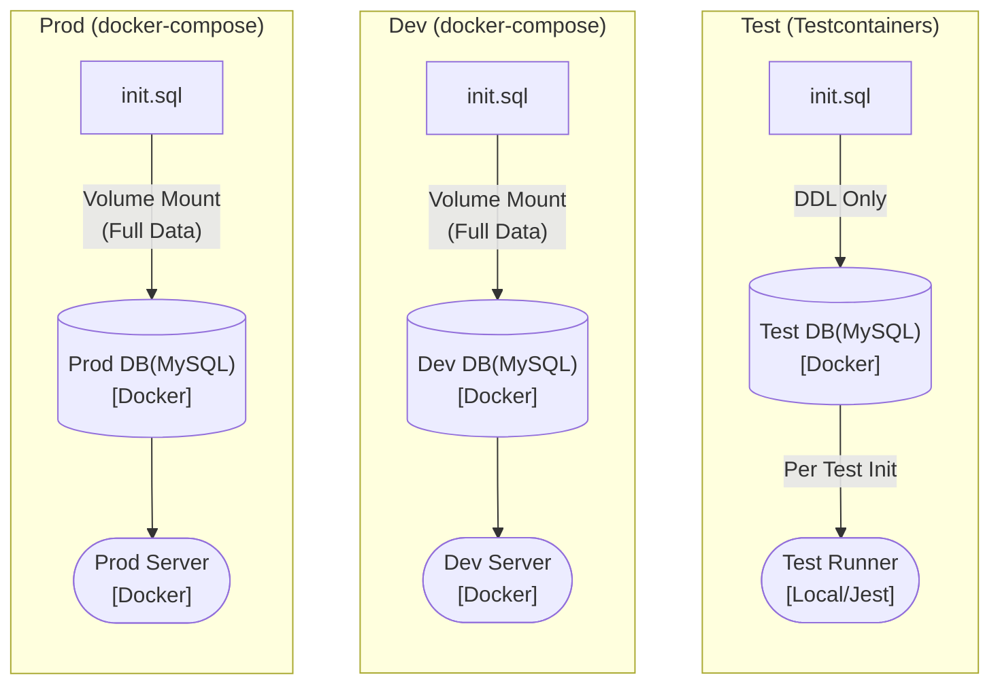

# Airbnb Clone — 대용량 숙소 검색 시스템

> 네이버 부스트캠프 멤버십 과정에서 1인으로 진행한 Airbnb 클론 프로젝트입니다.
> 프론트엔드, 백엔드, 인프라 전 영역을 직접 설계하고 구현했으며, 그 중 백엔드와 인프라에 가장 많은 시간을 투자했습니다.

## 프로젝트 목표

"실제 Airbnb라면 데이터가 얼마나 될까?"라는 질문에서 출발했습니다.
1000개의 숙소에 10년 치 예약 일정을 생성하면 약 300만 건의 데이터가 만들어집니다.
이 대용량 데이터 환경 속에서, MySQL 단일 환경만으로 검색 기능을 구현하는 것이 핵심 목표였습니다.

## 기술 스택

| 영역 | 기술 |
|---|---|
| Backend | TypeScript, NestJS, TypeORM |
| Database | MySQL 8.0 |
| Frontend | TypeScript, React 19, Vite |
| Infra | Docker, Docker Compose, Testcontainers |
| Test | Jest, Supertest, Testcontainers |

## 담당 영역 및 핵심 고민

저는 이 프로젝트에서 다음 세 가지를 직접 설계하고 구현했습니다.

### 1. 대용량 데이터 검색 (9,000ms → 5ms)

300만 건의 `listing_schedule` 테이블에서 날짜, 가격, 가용성 조건을 조합한 검색 쿼리가 초기에 9,000ms 이상 소요되었습니다.
이를 해결하기 위해 8가지 인덱스 후보군(C0~C7)을 구성하고, 각각에 대해 Read 속도, Write 속도, 실행 계획(EXPLAIN), 스캔 행수를 실험적으로 측정한 뒤 최종 커버링 인덱스를 도출했습니다.

특히 인덱스 컬럼 순서를 결정할 때, 일반적으로 알려진 "카디널리티가 높은 컬럼을 앞에 두라"는 규칙이 항상 맞는 것은 아니었습니다. 카디널리티가 2밖에 안 되는 `isAvailable` 컬럼이라도 등치 조건(`=`)으로 사용되면 범위 조건(`BETWEEN`)보다 선두에 위치해야 인덱스를 더 효율적으로 탈 수 있다는 것을, 직접 실행 계획을 비교하며 확인했습니다.

- 상세 의사결정 과정: [ADR-003 복합 인덱스 설계](./첨부파일/adr/003-covering-index-strategy.md)
- 검색 쿼리 분리 전략: [ADR-002 검색 쿼리 설계](./첨부파일/adr/002-search-query-separation.md)

### 2. 300만 건 시드 데이터 생성

외부 스크립트(Node.js)나 CSV 파일 없이, 재귀 CTE와 Cross Join만으로 단일 SQL 파일에서 300만 건의 데이터를 약 30초 만에 생성합니다.
Docker 컨테이너가 올라올 때 `init.sql` 하나로 스키마 생성과 데이터 삽입이 모두 완료되므로, 별도의 런타임 환경 없이 누구나 동일한 테스트 환경을 재현할 수 있습니다.

- 상세 의사결정 과정: [ADR-001 시드 데이터 전략](./첨부파일/adr/001-seed-data-strategy.md)

### 3. Docker 기반 환경 분리 및 테스트 격리

Prod와 Dev 환경은 Docker Compose로 관리하고, 테스트 환경은 Testcontainers를 통해 코드 레벨에서 MySQL 컨테이너를 자동으로 생성/삭제하는 구조로 분리했습니다.



테스트 환경에서는 300만 건의 시드 데이터를 삽입하지 않고 DDL(스키마)만 주입하여 테스트 기동 시간을 단축했습니다. 인메모리 DB(SQLite) 대신 실제 MySQL 컨테이너를 사용한 이유는, 커버링 인덱스 등 MySQL 고유의 실행 계획을 검증해야 했기 때문입니다.

- 상세 의사결정 과정: [ADR-004 인프라 전략](./첨부파일/adr/004-devops-docker-strategy.md)

## 실행 방법

### 백엔드 서버 기동
```bash
git clone https://github.com/shininghyunho/web-p4-bangbang project
cd project

# 배포용 (최초 기동 시 시드 데이터 생성으로 약 1분 소요)
docker compose up prod_backend --build

# 개발용
docker compose up dev_backend --build
```

### 테스트 실행
```bash
cd backend
npm install
npm run test:e2e
```

### 프론트엔드 기동
```bash
cd frontend
npm install
npm run dev
# localhost:5173 접속
```

## 실행 화면

*(검색 기능 및 테스트 실행 GIF를 직접 첨부할 예정입니다)*

---

*주차별 학습 기록은 [WEEKLY_LOGS](./docs/archive/WEEKLY_LOGS.md)에 보관되어 있습니다.*
