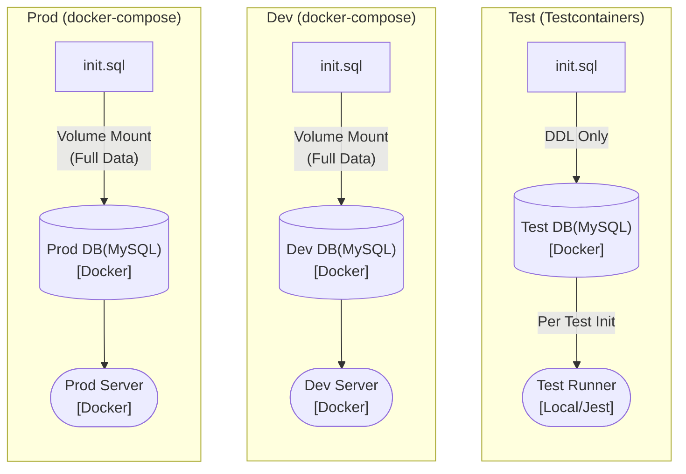

# [ADR-004] Docker 기반 환경 분리 및 Testcontainers 테스트 격리 전략

## 1. Summary
- 결정: 애플리케이션 및 데이터베이스의 실행 환경을 Docker 컨테이너로 표준화하고, 테스트 환경에는 Testcontainers를 도입하여 환경 격리와 테스트 효율성을 확보한다.
- 날짜: 2026-04-29

## 2. Context (배경)
- 문제 상황: 로컬 PC 환경(OS, Node 버전 등)에 따라 코드가 다르게 동작하는 환경 불일치 문제가 발생. 또한, 통합 테스트 시 이전 테스트가 변경한 데이터가 다음 테스트에 영향을 미치는 오염 문제가 발생함.
- 요구 사항 및 제약: Prod, Dev, Test 환경이 각각 독립적인 목적에 맞게 구성되어야 함.
  - Prod: 초기 데이터(Seed) + 데이터 영속성 보장.
  - Dev: 초기 데이터(Seed) + 데이터 영속성 + (필요시 초기화 가능).
  - Test: 데이터 영속성 불필요, 빠른 속도를 위해 초기 데이터 없이 DDL(스키마)만 제공.

## 3. Alternatives (대안 목록)
### 배포 및 실행 환경 대안
- 대안 A: 직접 배포 및 로컬 실행 (Docker 미사용)
  - 가볍고 직관적이나, 로컬 환경에 따라 설정이 달라짐.
- 대안 B (선택): Docker Container 운영
  - 컨테이너 실행을 위한 추가 리소스가 필요하지만, 모든 환경에서 동일한 설정이 보장됨.

### 테스트 DB 환경 대안
- 대안 A: 인메모리 DB (SQLite) 사용
  - 가볍지만, MySQL 전용 쿼리나 인덱스 구조가 다르게 동작하여 운영 환경과의 일치성이 떨어짐.
- 대안 B: 개발자가 수동으로 Test DB 컨테이너 관리
  - 직관적이나, 테스트마다 데이터를 비워주거나 상태를 관리해야 하는 번거로움이 있음.
- 대안 C (선택): Testcontainers 라이브러리 활용
  - 테스트 코드 실행 시 프로덕션과 동일한 MySQL 컨테이너를 자동으로 띄우고, 종료 시 자동으로 제거하여 환경 격리를 보장.

## 4. Decision (결정)
- 결론: Docker 기반의 환경 표준화 및 Testcontainers를 활용한 일회성 테스트 환경 구축.

- 구조:

- 환경별 실행 전략:
  - 운영(Prod): Docker로 실행 환경을 고정하고, 볼륨 마운트를 통해 데이터를 보존함.
  - 개발(Dev): 운영 환경과 구성을 일치시켜 일관적인 개발 환경을 제공함.
  - 테스트(Test): Testcontainers로 매 테스트마다 깨끗한 MySQL 컨테이너를 제공하되, 약 300만 건의 시드 데이터 없이 DDL만 주입하여 기동 속도를 높임.

## 5. Trade-offs (Pros/Cons)
- Pros (얻은 것)
  - 신뢰성 확보: 인메모리 DB가 아닌 실제 MySQL 환경에서 테스트를 수행하여, 커버링 인덱스 등 MySQL 고유의 실행 계획을 검증할 수 있음.
  - 환경 격리: Testcontainers를 통해 테스트 간 데이터 오염을 방지함.
- Cons (포기한 것)
  - 테스트 기동 시간: 컨테이너를 띄우고 DDL을 주입하는 시간이 추가됨. 다만 약 300만 건의 시드 데이터를 매번 삽입하는 것보다는 훨씬 빠름.

## 6. Retrospective (회고)

처음에 테스트 환경을 구성할 때 속도가 빠른 인메모리 DB(SQLite 등)를 사용하려고 했으나, 이 프로젝트의 핵심인 커버링 인덱스와 검색 쿼리가 SQLite에서는 MySQL과 다르게 동작할 수 있다는 점이 가장 큰 고민이었다.

그래서 테스트용 MySQL 컨테이너를 수동으로 띄우는 방식을 고려했지만, 테스트가 끝날 때마다 데이터를 비워주거나 상태를 관리해야 하는 번거로움이 있었다. 게다가 매번 약 300만 건의 데이터가 들어있는 `init.sql` 전체가 실행되면 테스트 기동 시간이 비현실적으로 길어지는 딜레마에 빠졌다.

결과적으로 Testcontainers를 도입하고, 코드 단에서 `init.sql`을 읽어와 무거운 `INSERT` 문만 정규식으로 걸러내어 DDL만 실행하도록 타협점을 찾았다. 처음에는 인프라 설정이 여러 곳으로 파편화되는 것 같아 찝찝했지만, 운영 환경과 동일한 DB 위에서 속도 저하 없이 독립된 테스트를 돌릴 수 있게 된 것이 가장 큰 수확이었다.